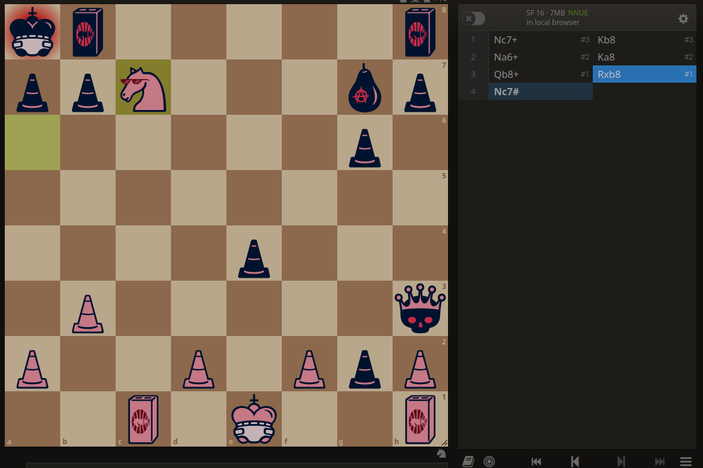

# Lets smother the King!

We were provided with the file `code.txt` with the content

```
D'`A_9!7};|jE7TBRdQbqM(n&JlGGE3feB@!x=v<)\r8YXtsl2Sonmf,jLKa'edFEa`_X|?UTx;WPUTMqKPONGFjJ,HG@d'=BA@?>7[;4z21U54ts10/.'K+$j(!Efe#z@a}vut:[Zvutsrqj0ngOe+Lbg`edc\"CBXW{[TSRvP8TMq4JONGFj-IBGF?c=a$@9]=6|:3W10543,P*/.'&%$Hi'&%${z@a}vut:xqp6nVrqpoh.fedcb(IHdcba`_X|V[ZYXWPOsMLKJINGkKJI+G@dDCBA#"8=6Z4z21U5ut,P0)(-&J*)"!E}e#"!x>|uzs9qvo5srkpingf,Mchg`_%cbaZBXW{>=YXWPOs65KPImMLEDIBf)(D=a$:?>7<54X210/43,Pqp(',+*#G'gf|B"y?}v^tsr8vuWsrqpi/POkdibgf_%]b[Z_X|?>TYRQu8TMqQPIHGkEJIBA@dD&B;@?8\<5{3W70/.-Q10/on,%Ij('~}|B"!~}_u;y[Zponm3qpoQg-kjihgfeG]#aCBXW{[ZYX:Pt7SRQJONMLEiIHA@?cCB$@9]~<;:921U543,10/.-&J*j('~}${A!~}vuzs9Zponm3qpihmf,jihgfeG]#n
```

The challenge description had names `Ben` and `Olmstead`

After searching for it, we see [Malbolge](https://en.wikipedia.org/wiki/Malbolge) esolang in the search results. After reading through the wiki, we see that Ben Olmstead was the creator of the language. 

After this the `code.txt`  was through a Malbolge interpreter, resulting int the following stdout:

```
White- Ke1,Qe5,Rc1,Rh1,Ne6,a2,b3,d2,f2,h2 Black- Ka8,Qh3,Rg8,Rh8,Bg7,a7,b7,e4,g2,g6,h7
```

Clearly it describes a chess board state, as stated in the problem.
[Lichess](https://lichess.org/study/46XyUJ6q/mCY1IPCZ) 

```
♚■□■□■♜♜
♟♟■□■□♝♟
□■□■♘■♟■
■□■□♕□■□
□■□■♟■□■
■♙■□■□■♛
♙■□♙□♙♟♙
■□♖□♔□■♖
```

As hinted in the challenge title, (assuming that it is white to move), it is a smother mate puzzle.

The mating moves being:

```Nc7+ Kb8 Na6+ Ka8 Qb8+ Rxb8 Nc7#```
 

Hence, finally 
# flag: `VishwaCTF{Nc7+_Kb8_Na6+_Ka8_Qb8+_Rxb8_Nc7#}`
