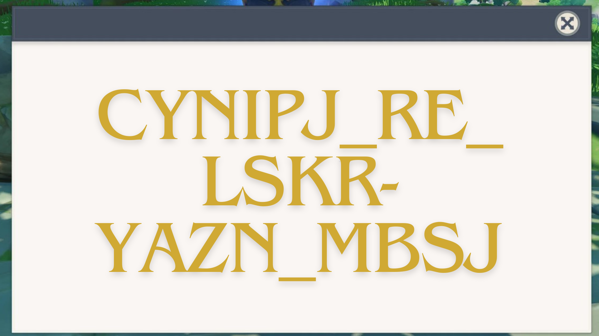

# Teyvat Tales

On the website, the `script.js` had all the answers which corresponded to

```
enigma m3
ukw c
rotor1 i p m rotor2 iv a o rotor3 vi i n
vi sh wa ct fx
```
The `styles.css` was linked to the following image file which had a cipher



I knew about enigma cipher (thanks to computerphile) and started finding a suitable decoder. Got [this](https://cryptii.com/pipes/enigma-machine)

Put the values in here and got the flag

# Flag: `VishwaCTF{beware_of_tone-deaf_bard}`
