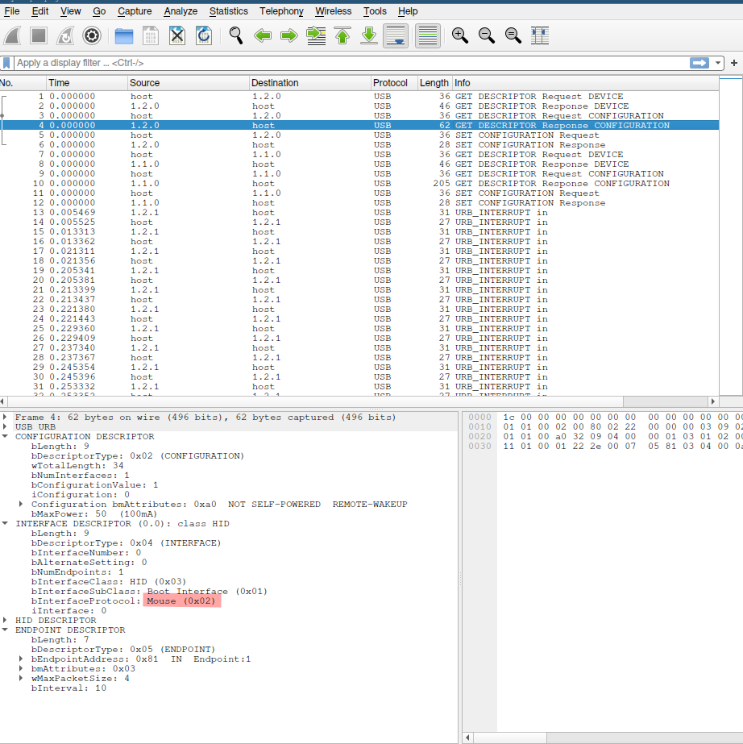
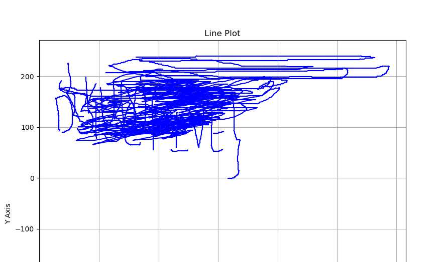
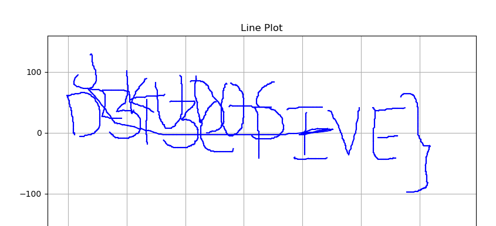

# Wired Secrets

The moment I saw USB HID data, I quickly started looking for the device.



I quickly searched the internet and understood the HID data. Then I extracted the HID data using tshark

```bash
tshark -r okay10.pcapng -T fields -e usbhid.data | grep -v "^$" > data.txt
```
Then wrote a simple python script with matplotlib

```python
import matplotlib.pyplot as plt
import struct

currentX = 0
currentY = 0

def twos_complement(hexstr, bits):
    value = int(hexstr, 16)
    if value & (1 << (bits - 1)):
        value -= 1 << bits
    return value

with open('data.txt', 'r') as f:
    data = f.read()

arr = data.strip().split("\n")

plt.xlabel('X Axis')
plt.ylabel('Y Axis')
plt.title('Line Plot')
plt.grid(True)

for j in range(len(arr)):
    i = arr[j]
    a,b,c = i[0:2], i[2:4], i[4:6]
    a = int(a, 16)
    b = twos_complement(b, 8)
    c = twos_complement(c, 8)
    if a == 1:
        plt.plot([currentX, currentX+b], [currentY, currentY-c], color='b')
    currentX += b
    currentY -= c

plt.show()
```

However I got this image



I animated the HID data to see the actual events

```python
import matplotlib.pyplot as plt
import struct

currentX = 0
currentY = 0

def twos_complement(hexstr, bits):
    value = int(hexstr, 16)
    if value & (1 << (bits - 1)):
        value -= 1 << bits
    return value

with open('data.txt', 'r') as f:
    data = f.read()

arr = data.strip().split("\n")

plt.xlabel('X Axis')
plt.ylabel('Y Axis')
plt.title('Line Plot')
plt.grid(True)

for j in range(len(arr)):
    i = arr[j]
    a,b,c = i[0:2], i[2:4], i[4:6]
    a = int(a, 16)
    b = twos_complement(b, 8)
    c = twos_complement(c, 8)
    if a == 1:
        plt.plot([currentX, currentX+b], [currentY, currentY-c], color='b')
        plt.pause(0.00000001) # Added this line
    currentX += b
    currentY -= c

plt.show()
```

Thus after the random scribling, the text was clearly visible



# Flag: `VishwaCTF{KUD0SD3T3CTIVE}`