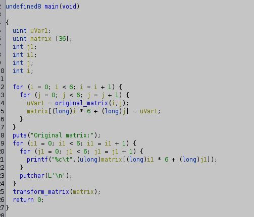
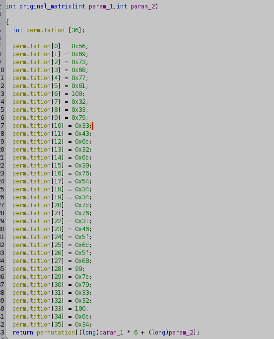

# Sandese Aate hai

Using [Ghidra](https://ghidra-sre.org/) decomplier on the provided binary and cleaning up a bit, we get the following:

 

```c
undefined8 main(void)

{
  uint uVar1;
  uint matrix [36];
  int j1;
  int i1;
  int j;
  int i;
  
  for (i = 0; i < 6; i = i + 1) {
    for (j = 0; j < 6; j = j + 1) {
      uVar1 = original_matrix(i,j);
      matrix[(long)i * 6 + (long)j] = uVar1;
    }
  }
  puts("Original matrix:");
  for (i1 = 0; i1 < 6; i1 = i1 + 1) {
    for (j1 = 0; j1 < 6; j1 = j1 + 1) {
      printf("%c\t",(ulong)matrix[(long)i1 * 6 + (long)j1]);
    }
    putchar(L'\n');
  }
  transform_matrix(matrix);
  return 0;
}
```
As we can see, the matrix is initalised in a different function, analyzing that, we find the following: 

Extracting the data using some vim magic, we get the following : 
```py
matrix=[0x56,0x69,0x73,0x68,0x77,0x61,100,0x32,0x33,0x79,0x33,0x43,0x6e,0x32,0x6b,0x30,0x76,0x54,0x34,0x34,0x7d,0x76,0x31,0x46,0x5f,0x6d,0x5f,0x68,99,0x7b,0x79,0x33,0x32,100,0x6e,0x34,]
```

Printing the characters in a 6x6 grid, we see the following: 

```
V i s h w a
d 2 3 y 3 C
n 2 k 0 v T
4 4 } v 1 F
_ m _ h c {
y 3 2 d n 4
```
Which very clearly is a spiral cipher. 
Reading the characters in a spiral, we get the flag: 

# Flag: `VishwaCTF{4nd23y_4nd23y_3v1ch_m42kov}`


