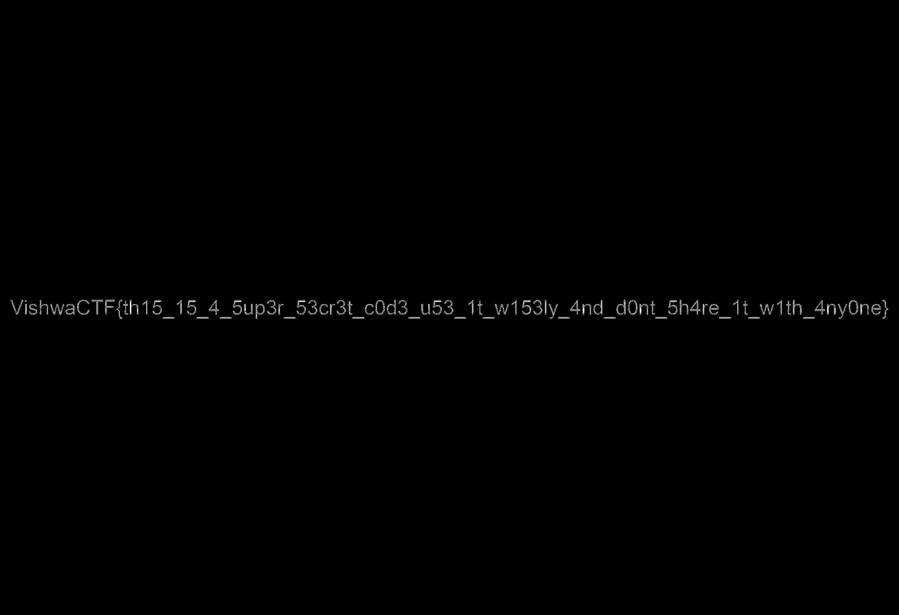

# Secret Code

Provided with `confidential.jpg` and `letter.txt`

letter.txt
```
To,
VishwaCTF'24 Participant

I am Akshay, an ex employee at a Tech firm. Over all the years, I have been trading Cypto currencies and made a lot of money doing that. Now I want to withdraw my money, but I'll be charged a huge tax for the transaction in my country.

I got to know that you are a nice person and also your country doesn't charge any tax so I need your help.

I want you to withdraw the money and hand over to me. But I feel some hackers are spying on my internet activity, so I am sharing this file with you. Get the password and withdraw it before the hackers have the access to my account.

Your friend,
Akshay
```

On running binwalk I got to know there was hidden zip file in `confidential.jpg`

Extracting it using foremost, I got 2 files - `helper.txt` and `5ecr3t_c0de.zip`

helper.txt
```
Hey buddy, I'm really sorry if this takes long for you to get the password. But it's a matter of $10,000,000 so I can't risk it out.

"I really can't remember the password for zip. All I can remember is it was a 6 digit number. Hope you can figure it out easily"
```

I quickly got the 6 digit password wordlist and started bruteforcing using john the ripper

The password was `945621`

The zip file gave 2 more files - `info.txt` and `5ecr3t_c0de.txt`

info.txt
```
What are these random numbers? Is it related to the given image? Maybe you should find it out by yourself
```

5ecr3t_c0de.txt had the tuples like these
```
(443, 1096)
(444, 1096)
(445, 1096)
(3220, 1096)
(3221, 1096)
(38, 1097)
(39, 1097)
(43, 1097)
(80, 1097)
(81, 1097)
...
```

I checked the width and height of image, and it seemed within the values here. I got that these were pixel coordinates. I quickly wrote the following script to color these pixels

```python
from PIL import Image

image = Image.open("confidential.jpg")

width, height = image.size

with open("5ecr3t_c0de.txt") as f:
    data = f.read()

arr = data.strip().split("\n")

for i in range(len(arr)):
    s = arr[i]
    s = s[1:-1]
    x = int(s.split(",")[0].strip())
    y = int(s.split(",")[1].strip())
    image.putpixel((x, y), (255, 255, 255))

image.save('final.jpg')
```
Got the image with flag in it



> Google lens helped doing the work of copying every letter :D

# Flag: `VishwaCTF{th15_15_4_5up3r_53cr3t_c0d3_u53_1t_w153ly_4nd_d0nt_5h4re_1t_w1th_4ny0ne}`
 