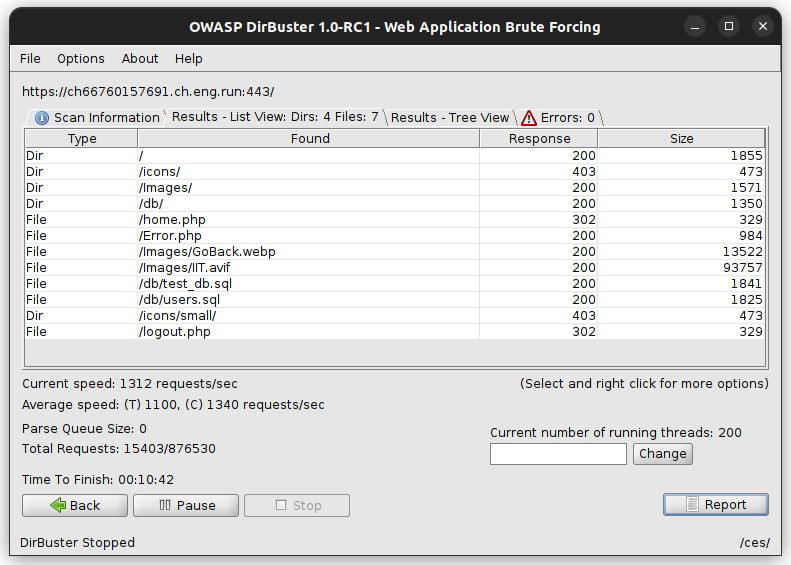
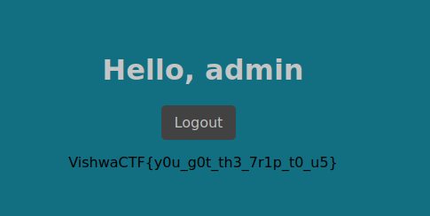

# Trip To Us 

After using [dirbuster](https://www.kali.org/tools/dirbuster/) for the given website, we see 

we see the following  
In particular, the following files are of interest to us:

- /db/users.sql
- /logout.php

In the `db/users.sql`  [users.sql](./files/users.sql)  we find the following:

```sql

INSERT INTO `users` (`id`, `user_name`, `password`, `name`) VALUES
(1, 'admin', 'unbre@k@BLE_24', 'admin');
```

And on the `logout.php` page, we see a prompt to enter username and password. Entering the admin's credentials, we see the following:

 


# Flag: `VishwaCTF{y0u_g0t_th3_7r1p_t0_u5}`
